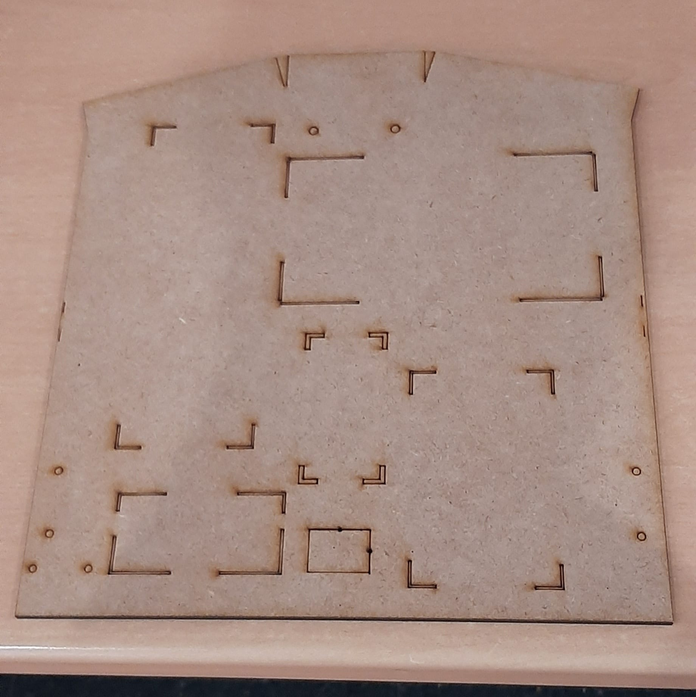
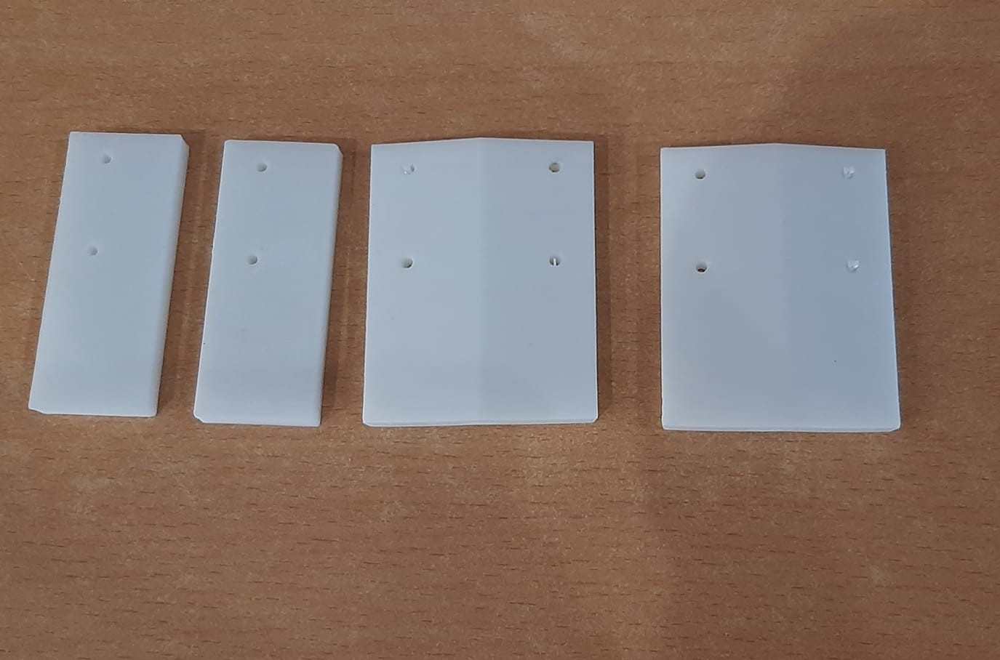
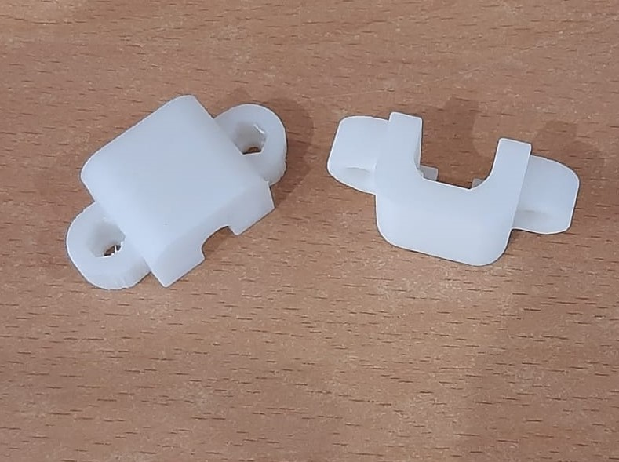
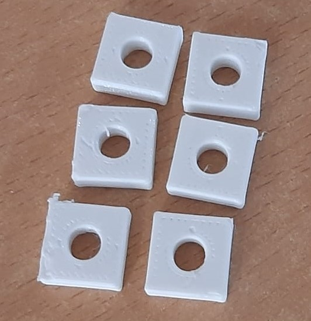

# BiblioBot
Project de l'assignatura Robòtica, llenguatge i planificació.

# Table of Contents
   * [What is this?](#what-is-this)
   * [Requirements](#requirements)
   * [Hardware](#hardware)
   * [Software](#software)
   * [3D printing](#3d-printing)
   * [Documentation](#documentation)
   * [How to use](#how-to-use)
   * [License](#license)
   * [Contribution](#contribution)
   * [Citing](#citing)
   * [Authors](#authors)
   * [Bibliography](#bibliography)

# What is this?
Projecte creat per un grup de 3 estudiants de la UAB que consisteix en la creació d'un robot dissenyat per ajudar als bibliotecaris i bibliotecàries a fer baixar el to de veu a la gent.

Features:
1. Autonomous movement module
2. Obstacle detection module
3. Audio advise module
4. Sound triangulation module
5. Person detection module

# Requirements
Per executar el codi d'aquest project:
- [Python 3.10.x](https://www.python.org/)
- [playsound](https://pypi.org/project/playsound/)
- [smbus](https://pypi.org/project/smbus-cffi/)

# Hardware

# Software

# 3D printing

Per a la realització del Bibliobot s'han hagut d'imprimir diverses peces 3d. Aquestes peces 3d s'han imprès a l'Open Lab de la Universitat Autònoma de Barcelona (UAB).

S'ha utilitzat el programa Fusion 360 per realitzar totes les peces.

La primera peça realitada és la peça principal del projecte ja que serà la base del nostre robot. La peça consta de la base i al seu interior hem dissenyat unes sub-peces per poder colocar els components corresponents sense que caiguin de la base amb el moviment del robot.
Aquestes subpeces són pestanyes que envolten les peces per així fixar-les a la base i al disseny es poden observar les peces que serveixen per anclar uns altres components amb cargols.

La base es va decidir fer amb la talladora làser en fusta ja que era molt més ràpid. 

A continuació mostrem el resultat:
  

*Base de fusta tallada a làser*

També es van realitzar els suports per mantenir fixos els sensors d'ultrasò HC-sr04, els motors i els micròfons. En el cas del sensors es van situar amb una diferència de 15 graus entre ells per poder detectar millor els obstàcles.

*Peces per aguantar els sensors HC-sr04 i mantenirlos a un angle de 15 graus entre ells*

*Suports de motors obtinguts d'internet*

*Peces per aguantar els micròfons de forma que quedin triangulats*

# Documentation
...

# How to use
1. Connectar-se el dispositiu raspberry pi zero w mitjançant ssh.

2. Clonar aquest repositori des de terminal.
> git clone https://github.com/ruben0606/BiblioBot.git

3. Instal·lar les llibreries necessaries.

Utilitzar l'eina pip:

> pip install -r requirements/requirements.txt

4. Executar el python script que es troba en la carpeta src.
> python src/Bibliobot.py

# License
MIT

# Use-case
Encara no tenim cap cas d'ús d'altres usuaris.

# Contribution
Qualsevol tipus de contribució serà benvinguda!

# Citing
Si utilitzeu el codi d'aquest projecte per al vostre propi projecte, us animem a citar els nostres treballs.

# Supporting this project
Agraïm que esteu interessats en aquest project, però no acceptem cap tipus donació.

# Authors
- [Col·laboradors d'aquest project](https://github.com/ruben0606/BiblioBot/graphs/contributors)

# Bibliography
1. https://rlpengineeringschooluab2017.wordpress.com/2017/05/31/soundhound/
2. https://rlpengineeringschooluab2017.wordpress.com/2017/05/30/the-follower/
