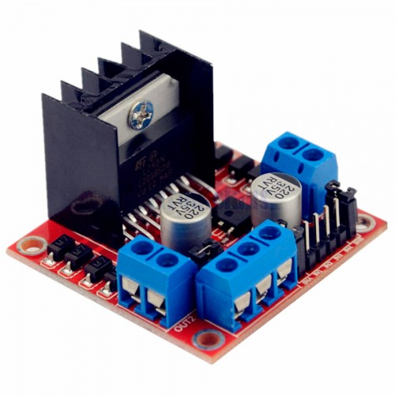
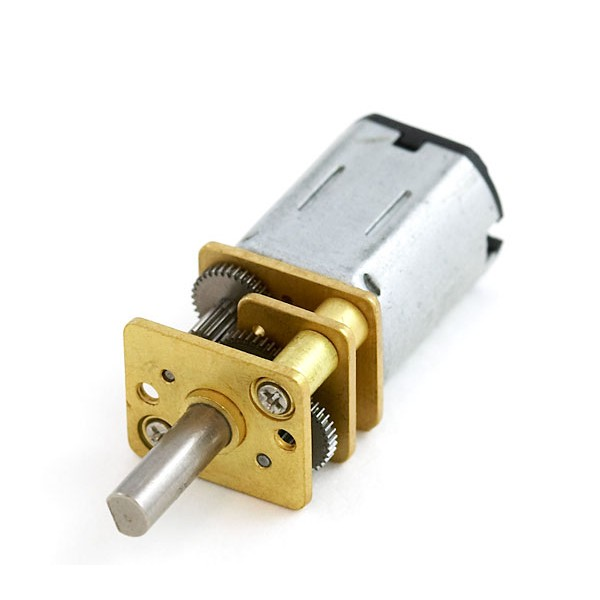
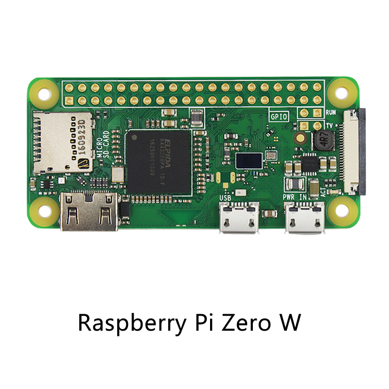
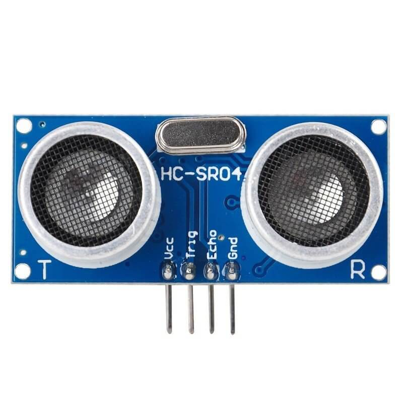
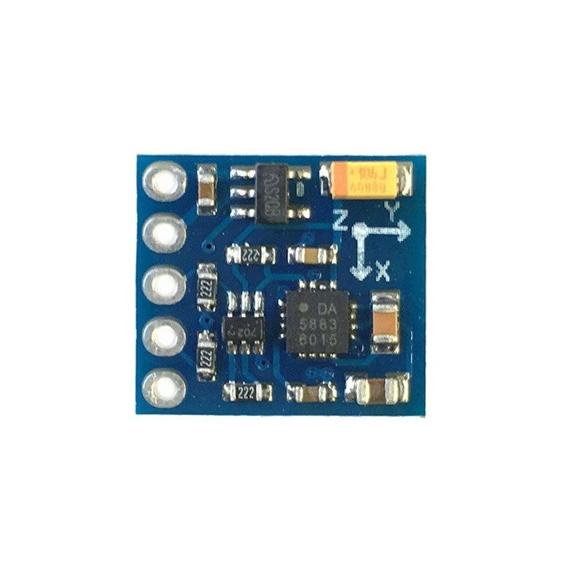
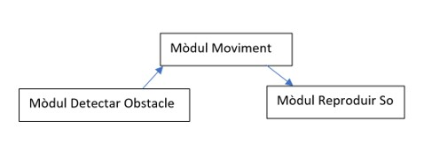
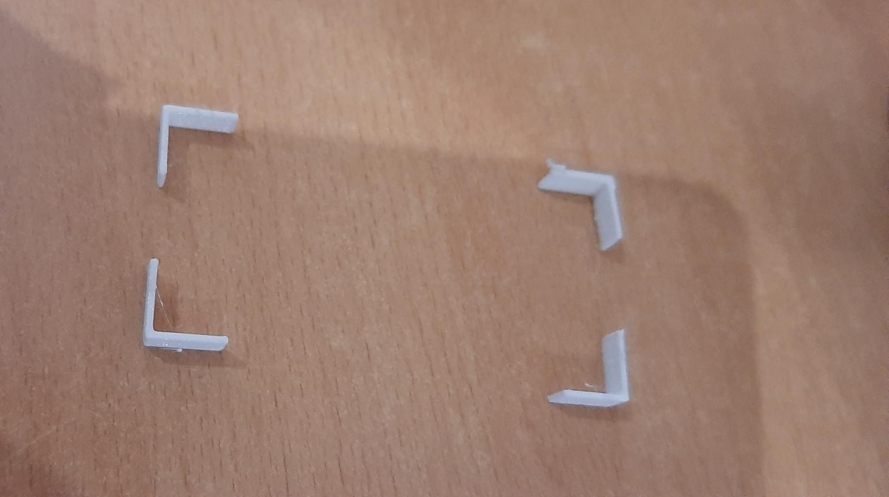

# BiblioBot
Project de l'assignatura Robòtica, llenguatge i planificació.

# Table of Contents
   * [What is this?](#what-is-this)
   * [Requirements](#requirements)
   * [Hardware](#hardware)
     * [Components](#components)
     * [Circuit](#circuit)  
   * [Software](#software)
   * [3D printing](#3d-printing)
   * [How to use](#how-to-use)
   * [License](#license)
   * [Contribution](#contribution)
   * [Citing](#citing)
   * [Sponsors](#sponsors)

   * [Authors](#authors)
   * [Bibliography](#bibliography)

# What is this?
Projecte creat per un grup de 3 estudiants de la UAB que consisteix en la creació d'un robot dissenyat per ajudar als bibliotecaris i bibliotecàries a fer baixar el to de veu a la gent.

Features:
1. Autonomous movement module
2. Obstacle detection module
3. Audio advise module
4. Sound triangulation module
5. Person detection module

# Requirements
Per executar el codi d'aquest project:
- [Python 3.10.x](https://www.python.org/)
- [playsound](https://pypi.org/project/playsound/)
- [smbus](https://pypi.org/project/smbus-cffi/)

# Hardware

## Components

Per realitzar el Bibliobot s'han utilitzat una sèrie de components que podeu trobar en la seva totatilat fent click al següent enllaç:

[Enllaç components](https://github.com/ruben0606/BiblioBot/blob/main/components/components.txt)

A continucació mostrem els principals components acompanyats d'una petita explicació del seu ús en el nostre projecte.

*Batería que alimentarà els motors*

*Driver L298N que serviràn per manipulars els motors desde la Raspberry*

*Motors s'encarregaràn de transmetre moviment a les rodes*

*Raspberry Pi Zero W, s'encarrega de controlar la resta de components*

*Sensors d'ultrasò HC-SR04 detecta obstacles a una certa distància del robot*

*Brúixola que indicarà la direcció del nord per poder orientar al Bibliobot.*

## Circuit

A continuació es pot observar una simulació del circuit necessàri realitzat amb Fritzering. Per obtenir tots els components s'haurà de descarregar una sèrie de llibreries que deixem a l'enllaç de continuació:

[Llibreries fritzering](https://github.com/adafruit/Fritzing-Library)

Si voleu saber quins pins hem utilitzat específicament per realitzar la versió final del bibliobot els podeu consultar al següent enllaç:

[Pinout Bibliobot](/pinout_bibliobot.txt)

# Software

A nivell de software el projecte conté tres grans mòduls:

-**Mòdul de Moviment:**
S'encarrega del moviment del robot, que es podrà moure en les quatre direccions, cap endavant, endarrera, esquerra i dreta.
Simplement conté la programació perquè el robot pugui avançar cap a la direcció que se l'indiqui en tot moment segons la situació actual que tingui.
Aquesta situació actual dependrà de si el mòdul de detecció d'obstacles li informa que hem topat amb un obstacle.

-**Mòdul de detecció d'obstacles:**
S'encarrega de detectar els obstacles que el Bibliobot va trobant al llarg del seu recorregut. Aquest mòdul informarà al mòdul de moviment quan detecti un obstacle i li dirà per quina direcció l'ha detectat. Això ho sabrà segons quin sensor d'ultrasò HC-sr04 hagi detectat l'obstacle i li passarà a l'altre mòdul una senyal perquè pugui actuar.
Els sensors estàn separats amb una angle de 15 graus entre si per poder localitzar correctament si un objecte es troba davant, a l'esquerra o a la dreta i que no pugui haver confusió.

-**Mòdul de reproducció de so:**
S'encarrega de reproduïr una frase a través d'un altaveu un cop hagi arribat al destí per fer saber a la persona indicada que ha de baixar el to de veu. Depèn del mòdul de moviment per saber quan arribem al destí, que serà quan ha d'executar l'ordre.
Un cop intervé aquest mòdul Bibliobot ha acabat la seva tasca i espera a tornar a haver d'intervenir.

A continuació es mostra una imatge amb els mòduls software i les dependències entre ells:

**PROGRAMA PRINCIPAL**
El programa principal (main) s'encarrega d'inicialitzar els pins i variables i cridar a les funcions corresponents als mòduls de software per obtenir la solució. 
En aquest cas la crida a alguns mòduls retornarà l'entrada a uns altres (com la detecció d'obstacles i el moviment) i gestionarà a quina posició ha d'anar Bibliobot i quan ha arribat a la mateixa.
El programa consta bàsicament d'un bucle continu en el qual el robot farà el següent:

1.Moviment cap endavant.

2.Si no detecto objecte: 

  2.1.continuo
  
3.Si detecto objecte:

  3.1.canvi direcció
  
  3.2.reubico direcció principal
  
4.Si arribo a destí:

  4.1.comunico a través de la veu
  
5.Si no arribo:

6.repeteixo procés (punt 1)

# 3D printing

Per a la realització del Bibliobot s'han hagut d'imprimir diverses peces 3d. Aquestes peces 3d s'han imprès a l'Open Lab de la Universitat Autònoma de Barcelona (UAB).

S'ha utilitzat el programa Fusion 360 per realitzar totes les peces.

La primera peça realitada és la peça principal del projecte ja que serà la base del nostre robot. La peça consta de la base i al seu interior hem dissenyat unes sub-peces per poder colocar els components corresponents sense que caiguin de la base amb el moviment del robot.
Aquestes subpeces són pestanyes que envolten les peces per així fixar-les a la base i al disseny es poden observar les peces que serveixen per anclar uns altres components amb cargols.

La base es va decidir fer amb la talladora làser en fusta ja que era molt més ràpid. 

A continuació mostrem el resultat:
  

*Base de fusta tallada a làser*

També es van realitzar els suports per mantenir fixos els sensors d'ultrasò HC-sr04, els motors i els micròfons. En el cas del sensors es van situar amb una diferència de 15 graus entre ells per poder detectar millor els obstàcles.

*Peces per aguantar els sensors HC-sr04 i mantenirlos a un angle de 15 graus entre ells.*

*Suports de motors obtinguts d'internet*

*Peces per aguantar els micròfons de forma que quedin triangulats*

Per últim, com hem esmentat abans, s'han realitzat múltiples pestanyes per fixar els components més pesats i amb major risc de voltejar o caure.

*Exemple de pestanyes per fixar els components*

# How to use
1. Connectar-se el dispositiu raspberry pi zero w mitjançant ssh.

2. Clonar aquest repositori des de terminal.
> git clone https://github.com/ruben0606/BiblioBot.git

3. Instal·lar les llibreries necessaries.

Utilitzar l'eina pip:

> pip install -r requirements/requirements.txt

4. Executar el python script que es troba en la carpeta src.
> python src/Bibliobot.py

# License
MIT

# Use-case
Encara no tenim cap cas d'ús d'altres usuaris.

# Contribution
Qualsevol tipus de contribució serà benvinguda!

# Citing
Si utilitzeu el codi d'aquest projecte per al vostre propi projecte, us animem a citar els nostres treballs.

# Supporting this project
Agraïm que esteu interessats en aquest project, però no acceptem cap tipus donació.

# Sponsors

### [Open Labs UAB](https://www.uab.cat/open-labs/)

Impressió de peces 3D amb ells de forma gratuïta per projecte de la UAB.

### [Universitat Atònomma de Barcelona (UAB)](https://www.uab.cat/)

Facilitació dels components necessàris per la realització del projecte.

# Authors
- [Col·laboradors d'aquest project](https://github.com/ruben0606/BiblioBot/graphs/contributors)

# Bibliography
1. https://rlpengineeringschooluab2017.wordpress.com/2017/05/31/soundhound/
2. https://rlpengineeringschooluab2017.wordpress.com/2017/05/30/the-follower/
3. https://www.electronicshub.org/raspberry-pi-l298n-interface-tutorial-control-dc-motor-l298n-raspberry-pi/
4. https://cdn.sparkfun.com/assets/learn_tutorials/6/7/6/PiZero_1.pdf
5. https://blog.330ohms.com/2020/06/17/como-conectar-un-sensor-ultrasonico-a-raspberry-pi/
6. https://github.com/ShrimpingIt/micropython-dfplayer
7. https://www.reddit.com/r/raspberrypipico/comments/q19v0n/dfplayer_with_pico/
8. https://www.electroallweb.com/index.php/2020/07/22/modulo-dfplayer-mini-reproductor-mp3-tutorial-completo/
9. https://pimylifeup.com/raspberry-pi-omxplayer/
10. https://www.hackster.io/miguel-a-lopez-monzon/triangulation-of-sound-87d3b8
11. https://forums.raspberrypi.com/viewtopic.php?t=165996
12. https://forum.arduino.cc/t/sound-triangulation-with-3-microphones/122940
13. https://www.youtube.com/watch?v=3LBiyBTnt7g&ab_channel=Maker%27sDigest
14. http://dimcad3d.com/2016/04/27/fusion-360-tutoriales-en-espanol/
15. https://descubrearduino.com/audio-bluetooth-raspberry-pi/
16. https://www.electronicwings.com/raspberry-pi/mpu6050-accelerometergyroscope-interfacing-with-raspberry-pi
17. https://forums.raspberrypi.com/viewtopic.php?t=184556
18. https://electropeak.com/learn/interfacing-gy-271-hmc5883l-compass-magnetometr-with-arduino/
19. https://arduinoque.com/robots/sensor-de-movimiento-raspberry-pi/
20. https://forums.raspberrypi.com/viewtopic.php?t=166156
21. 
